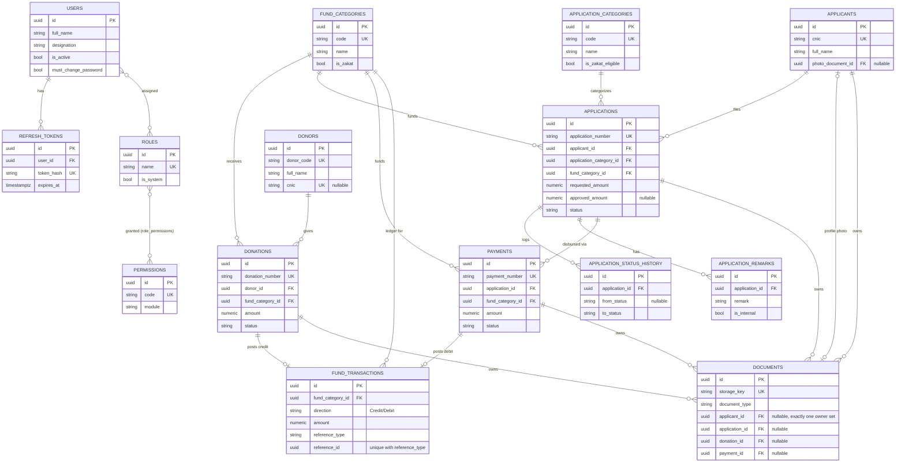

# ER Diagram — NGO Fund Management System (Phase 1)

Companion to `docs/schema.md`. Identity plumbing tables (`user_roles`, `user_claims`,
`role_claims`, `user_logins`, `user_tokens`) are omitted for readability — they are standard
ASP.NET Identity join tables with no NGO-specific columns.

